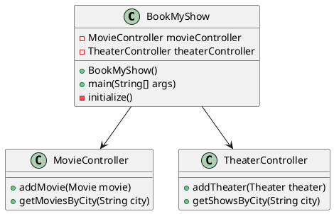

# LLD-BookMyShow
# BookMyShow

## Overview
BookMyShow is a Java-based application that allows users to browse and book movie tickets. The application manages movies, theaters, screens, seats, and shows.

## Features
- Add movies
- Add theaters
- Get movies by city
- Get shows by city

## Classes

### BookMyShow
- Manages the overall application
- Initializes controllers for movies and theaters

### MovieController
- Manages movie-related operations

### TheaterController
- Manages theater-related operations

## Getting Started

### Prerequisites
- Java Development Kit (JDK) 8 or higher
- IntelliJ IDEA 2022.2.2

### Installation
1. Clone the repository:
   ```sh
   git clone https://github.com/swatantra-coder/BookMyShow.git
   ```
2. Open the project in IntelliJ IDEA.

### Usage
1. Run the `BookMyShow` class.
2. Initialize the application.
3. Add movies and theaters.
4. Retrieve movies and shows by city.

## License
This project is licensed under the MIT License.

## UML Diagram



## Authors
- swatantra-coder
